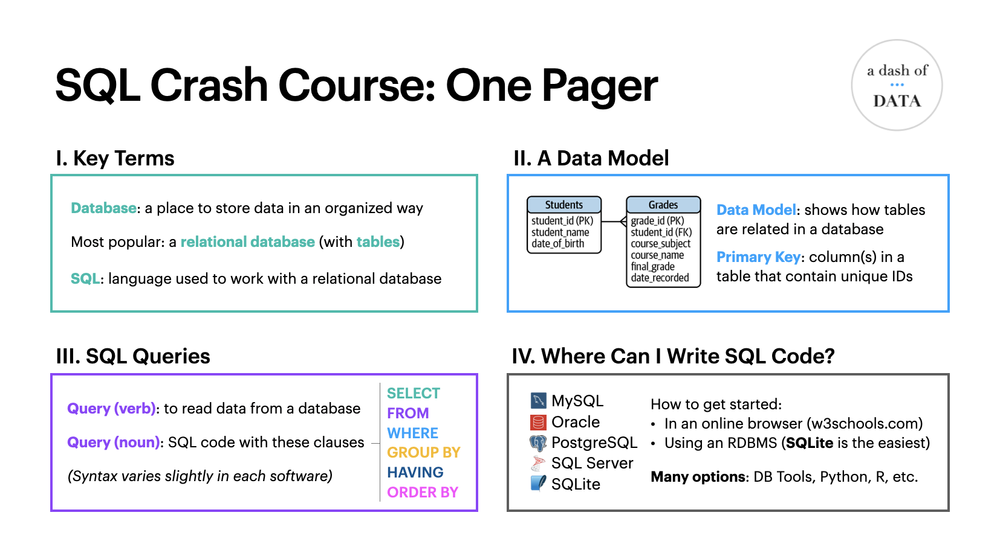

# SQL Crash Course

These files accompany the 1 hour tutorial on [YouTube](https://youtu.be/2kHV2_CXJ38).

It covers the content in the first chapter of my book, [SQL Pocket Guide, 4th Edition (O'Reilly)](https://amzn.to/3hGHfAV).

## Want to explore the tables on your own?
* [create_student_grades_database.sql](create_student_grades_database.sql) - SQL statements to create the Students and Grades tables in [SQLite](https://www.sqlite.org/download.html)
* [student_grades.db](student_grades.db) - SQL database file that can be downloaded and opened using SQLite or a database tool (like [DBeaver](https://dbeaver.io/download/))

## Summary of the tutorial

## Access the full book online via [O'Reilly's learning platform](https://www.oreilly.com)

To read the _SQL Pocket Guide, 4th Edition_ (and any other O'Reilly book) for free:

* [30 Day Trial Code](https://learning.oreilly.com/get-learning/?code=SQLPG21): SQLPG21
* Your local public library / university / company may have a subscription
